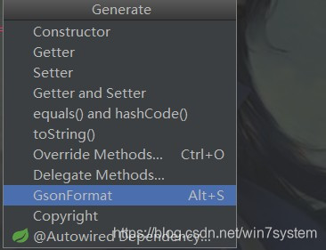
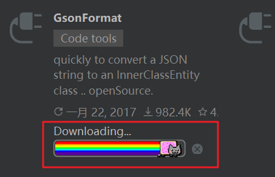

[idea插件：Marketplace](https://plugins.jetbrains.com/)

# Alibaba Java Coding Guidelines

阿里巴巴Java编码指南插件支持。

# GsonFormat

在与组外或者不同部门对接接口时候发现，有时候对方返回的是JSON对象，自己想要用一个对象去接受，以便于处理后续，此时，需要自己一个个手动去输入属性么，肯定很抓狂，不过咱们可以使用这个插件来解决这个尴尬问题，当然也可以使用外部网址解决，比如bejson这个网站~ 

# Rainbow Brackets

链接[Rainbow Brackets](https://plugins.jetbrains.com/plugin/10080-rainbow-brackets)

---

# Nyan Progress Bar

猛男进度条

